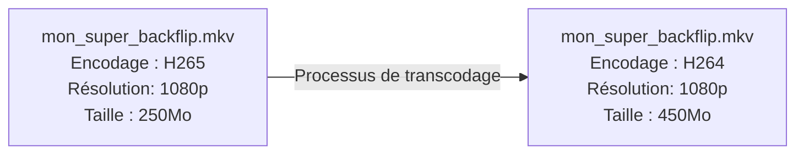
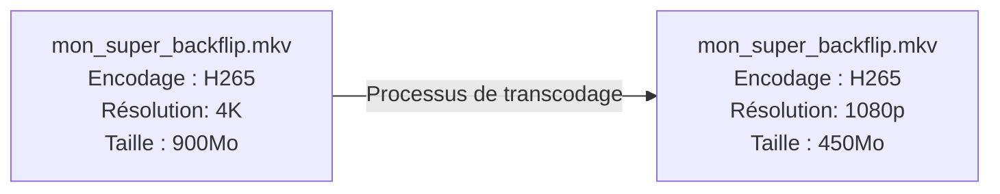

---
# try also 'default' to start simple
theme: default
# some information about your slides, markdown enabled
title: Créer son propre service de streaming vidéo
info: |
  ## Créer son propre service de streaming vidéo

  Présenté par Damien Fernandes [@damienfern](https://github.com/damienfern)
# apply any unocss classes to the current slide
class: text-center
# https://sli.dev/custom/highlighters.html
highlighter: shiki
# https://sli.dev/guide/drawing
drawings:
  persist: false
# slide transition: https://sli.dev/guide/animations#slide-transitions
transition: slide-left
# enable MDC Syntax: https://sli.dev/guide/syntax#mdc-syntax
mdc: true
fonts:
  sans: Crete Round
  # sans: Poppins
---


# Créer son propre service de streaming vidéo


Damien Fernandes

<hr/>

<div style="display: flex;justify-content: space-between; padding-top: 20px;">
  
  
  
</div>

<!-- <div class="abs-br m-6 flex gap-2">
  <a href="https://github.com/damienfern" target="_blank" alt="GitHub" title="Open in GitHub"
    class="text-xl slidev-icon-btn opacity-50 !border-none !hover:text-white">
    <carbon-logo-github />
  </a>
  <a href="www.linkedin.com/in/damien-fern" target="_blank" alt="LinkedIn" title="Open in LinkedIn"
    class="text-xl slidev-icon-btn opacity-50 !border-none !hover:text-white">
    <carbon-logo-linkedin />
  </a>
</div> -->

<style>

hr {
  width:25%;
  margin: auto;
}

.inline-img {
  width: 15%;
  height: auto;
  border-radius: 20px;
}
</style>

---
layout: image-right
image: /portrait.jpg
---

# Moi, c'est Damien

26 ans et toutes ses dents (presque) !

Développeur chez Wanadev depuis 2 ans

- Vue
- Symfony
- Infra (principalement DevOps)
- Tout ce qui me passe sous la main


## Ma mission : 

Développement du backoffice de Kazaplan, un outil de conception de maison 3D utilisable directement dans votre navigateur


---
title: Intro wanatournoi
transition: fade-out
layout: image
image: /PosterFinal.jpg
backgroundSize: 80% 80%
---

<!-- 
Connaissez-vous ceci ?

Bien normal car c'est un évènement interne à Wanadev : le wanatournoi
-->

---
transition: fade-out
layout: image-right
image: /Assassinge.png
---

# Le Wanatournoi

- Une compétition de jeux vidéo entre les employés de Wanadev
- 4 équipes qui s'affrontent sur une multitude de jeux
- Une première édition débutée avant le COVID, qui a permis de garder un lien pendant cette période d'isolement
- Un stream Youtube avec des présentateurs pour suivre tout ça

<!--
une compétition suivi par les joueurs mais aussi des employés ne participant pas
-->

---

# 2e édition du Wanatournoi

<v-click>
  <div class="grid">
    
    
    
    
    
    
    
    
    
  </div>
</v-click>

<style>
.grid {
  display: grid;
  grid-template-columns: repeat(3, 1fr);
  grid-gap: 10px;
}

.small-img {
  max-height: 100px;
  width: auto;
  height: auto;
}
</style>

<!--
Nouvel édition, nouveaux jeux.

Petite réunion pour choisir les jeux.

"Est-ce qu'il y a un mode spectateur sur ces jeux ?"
-->

---
layout: quote
---
# Le mode spectateur

## Voir le gameplay et les actions des joueurs en direct, mais sans pouvoir interagir avec le jeu.


---

# Comment ça pas de spec mode disponible ?

<div class="grid">
  <HideThePain></HideThePain>
  
  <HideThePain></HideThePain>
  <HideThePain></HideThePain>
  <HideThePain></HideThePain>
  
  <HideThePain></HideThePain>
  
  <HideThePain></HideThePain>
</div>

<style>
.grid {
  display: grid;
  grid-template-columns: repeat(3, 1fr);
  grid-gap: 10px;
}

.small-img {
  max-height: 100px;
  width: auto;
  height: auto;
}
</style>

---
layout: center
---
## Choix des jeux : <span v-mark="{ at: 2 , color: 'red'}">Juin 2023</span>


<v-click>

## Épreuve n°1 : <span v-mark="{ at: 2, color: 'red' }">14 septembre 2023</span>

</v-click>

<br/>

<v-click at="3" >


</v-click>

<!-- 
Après le 3 mois:

Début avec le jeu avec le plus de participants -> Among Us
 -->

---
layout: image
image: /amongus_logo.jpg
backgroundSize: fit
title: Premier jeu - Among Us
---

---
layout: two-cols
---

# Le principe d'Among Us

- Grandement inspiré du jeu de société le Loup Garou de Thiercelieux
- 12 joueurs réparant leur vaisseau spatial via des mini-jeux
- Parmi eux, 3 imposteurs devant tuer les autres joueurs
- Communication interdite, sauf pendant les meetings


::right::

<div class="list-crewmate">
  <Crewmate v-for="(n,index) in 12" :svg-color-index="index" style="width: 100px; height: 100px;"/>
</div>

<style>
.list-crewmate {
  display: grid;
  grid-template-columns: repeat(3, 1fr);
  grid-gap-columns: 10px;
  grid-gap-rows: 10px;
}
</style>

---
layout: image
image: /dead_body_reported.jpg
backgroundSize: 80% 80%
title: Among Us - La mort
---

---
layout: image
image: /AmongUs_CrewmateMeeting.jpg
backgroundSize: 80% 80%
title: Among Us - Les meetings
---

---
layout: image
image: /ejected-among-us.webp
backgroundSize: 80% 80%
title: Among Us - Ejected
---

<!--
Un énorme enjeu à suivre les actions des imposteurs

En tant que spectateurs, on veut :
- voir les kills en direct 
- voir la stratégie des imposteurs et s'ils vont s'en sortir
-->

---
layout: quote
---

# Comment suivre les faits et gestes des joueurs pour suivre ce qu'il se passe ?

<!--
L'idée : récupérer les écrans des joueurs et les afficher aux présentateurs
-->

---

# De quoi avons-nous besoin ?

- Une solution pour partager l'écran d'un joueur
- Une solution pour centraliser les écrans
- Une interface pour afficher l'écran des joueurs aux présentateurs

---
layout: image-right
image: https://debugpointnews.com/wp-content/uploads/2023/11/obs11.jpg
---

# Partager son écran avec OBS Studio

<br/>

- Capture d'écran
- Gratuit et disponible sur toutes les plateformes
- Configuration avancée
- Facile à utiliser

<!-- 

Configuration avancée: Personnalisez votre configuration avec des options avancées comme le bitrate, la résolution et les codecs. 

Facile à utiliser : mise à disposition d'un doc de configuration
-->

---
layout: two-cols
---

# Centraliser les écrans 
avec MediaMTX

Serveur écrit en Go et anciennement appelé rtsp-simple-server

Fonctionnalités :

- Publier un flux vidéo 
- Lire un flux vidéo depuis le serveur
- Différents protocoles pour lire un flux vidéo
- Possibilité de modifier le flux en direct
- API [(Doc ici)](https://bluenviron.github.io/mediamtx/)


::right::


<div class="grid grid-cols-2">
<div>


</div>
<div>


</div>
</div>

Avantages :

- README clair et contient toutes les informations pour commencer
- Beaucoup de protocoles disponibles pour publier et lire un flux vidéo
- Open Source (Licence MIT)

Lien Github : https://github.com/bluenviron/mediamtx


---

# API ? Ca se mange une API non ?


---
layout: center
---

# Récap de nos besoins

- <carbon-checkmark-outline v-click="1" color="green" /> Une solution pour partager l'écran d'un joueur <span v-click="1">: OBS Studio</span>
- <carbon-checkmark-outline v-click="2" color="green" /> Une solution pour centraliser les écrans <span v-click="2">: MediaMTX avec son API</span>
- <carbon-in-progress v-click="3" color="yellow" /> <span v-mark="{ at: 3, color: 'yellow'}">Une interface pour afficher l'écran des joueurs aux présentateurs</span>


<style>
ul {
  list-style-type: none;
}
</style>

<!--
Je suis un dev web qui sait faire du Vue

-> on va faire du web
-->

---
layout: quote
---

# De quoi est composé un fichier vidéo ?

<v-click> 
<br />

# <EmojiSparkles />

# Une vidéo c'est comme une boite de Granola

</v-click>

---
layout: two-cols
title: Granola analogie
---

## Un contenant
<br/>


<br/>

<v-click>

Décrire le gâteau :

</v-click>

<v-click>

- Goût 
- Forme
- Marque
- Ingrédients

</v-click>


::right::

# Un contenu

<br/>


<v-click>

Le gâteau "brut"

</v-click>

<v-click>

- Farine
- Chocolat au lait
- Lait
- Beurre

</v-click>

---
layout: center
---

# Et mes fichiers vidéos dans tout ça ?

<v-click>


</v-click>
---
layout: two-cols
---

# Le contenant

Le container (ou wrapper)

Décrire le flux vidéo :
- Organisation des données (résolution, le débit d'image)
- La norme (H264, H265/HEVC, AV1, VP8/9)
- Les sous-titres
- Le chapitrage
- ...etc.

L'extension du fichier indique le conteneur utilisé.

::right::

Exemple :
- AVI `.avi`
- Flash Vidéo `.flv`
- Quicktime `.mov`
- MPEG 1/2/3/4 `.mpeg` `.mp4`
- Matroska `.mkv`
- WebM `.webm` dérivé de mkv

<!--
https://fr.wikipedia.org/wiki/Format_conteneur
-->

---

# Le contenu

##

Des données encodées/décodées selon des normes par un logiciel/matériel appelé CODEC.

<v-click>

<span style="color: red;">CO</span><span style="color: green;">DEC</span> : <span style="color: red;">CO</span>der/<span style="color: green;">DEC</span>oder

</v-click>

<v-click>

## Exemple de normes d'encodage

<br/>

- H262
- MPEG-4 : c'est ce qu'on appellait DivX à l'époque
- H.264 / MPEG-4 AVC
- VP6/7/8/9
- H265 / HEVC
- AV1

</v-click>

<!--
https://fr.wikipedia.org/wiki/Codec
-->

---

# Le problème des codec

- Faut les installer sur les devices (Smartphone, PC, etc)
- Des codecs non compatibles avec certains appareils
  - AV1 non disponible sur les produits Apple en 2023 
  - H265 non disponible pour les anciens appareils
- des codecs plus gourmands en ressources que d'autres

<br/>
<br/>
<br/>

<v-click>

# Que fait-on lorsque l'encodage choisi ne va pas ?

</v-click>

<!--
https://fr.wikipedia.org/wiki/Codec

Qu'est-ce qu'on fait quand le format ne nous va pas ?

On transcode

-->
---

# Le transcodage

Changer l'encodage d'une vidéo.

Changer d'encodage :



Réduire la résolution :



---

# Les solutions pour transcoder

| Type de personne                                  | Solution                             |
| ------------------------------------------------- | ------------------------------------ |
|  | [Handbrake](https://handbrake.fr/)   |
|  | [Unmanic](https://docs.unmanic.app/) |
|  | [FFMPEG](https://ffmpeg.org/)        |


<v-click>

Des solutions SaaS existent mais inconnues pour moi

</v-click>
---
layout: quote
---

# Mais nous, est-ce qu'on a besoin de transcoder ?

<v-click>

- Quels sont les codecs compris par les navigateurs ?
- Qu'est-ce que OBS peut envoyer ?

</v-click>

---
routeAlias: nav-codecs-tab
---

# Un navigateur, il comprend quels codecs ?

| Navigateur | H264                                       | H265                                       | VP9                                        | AV1                                        |
| ---------- | ------------------------------------------ | ------------------------------------------ | ------------------------------------------ | ------------------------------------------ |
| Chrome*    | <carbon-checkmark-outline color="green" /> | <carbon-error-outline color="red" />       | <carbon-checkmark-outline color="green" /> | <carbon-checkmark-outline color="green" /> |
| Firefox*   | <carbon-checkmark-outline color="green" /> | <carbon-error-outline color="red" />       | <carbon-checkmark-outline color="green" /> | <carbon-checkmark-outline color="green" /> |
| Safari*    | <carbon-checkmark-outline color="green" /> | <carbon-checkmark-outline color="green" /> | <carbon-checkmark-outline color="green" /> | <carbon-error-outline color="red" />       |


*: dans leur dernière version

Source : https://caniuse.com/?search=video%20format

<!--
# Comment ils font les géants de la tech ?

Netflix, Youtube, Twitch

Netflix : AV1 sur les tel android depuis 2020 et les TV

YOUTUBE : AV1 & VP9 selon les vidéos

Des grosses équipes d'experts dédiées qu'à ça.
-->

---

# Comment on gère tout ça de notre coté ?

- Encodage en H264 avec x264 par OBS Studio sur les PC des joueurs

> Sacrifice de quelques % de CPU sur le PC des joueurs mais pas dramatique

- Pas de transcodage nécessaire car lisible directement dans le navigateur
> Serveur peut être lancé sur n'importe quel PC car relai seulement

<br/>


---
layout: center
---

# La balise HTML `<video>`

<v-click>

> But : Lire une vidéo dans le navigateur 

</v-click>

<v-click>
  
</v-click>

---

# Les attributs intéressants

```js {*|2|3|4|5|6|7|8}
<video
  autoplay="true"
  loop="true"
  muted="false"
  poster="/suprised_vignette.jpg"
  controls="true"
  preload="metadata"
  src="filename.mp4"
>
</video>
```

<!-- 

- `autoplay` lance la vidéo dès qu'elle est disponible
- `loop` lance la vidéo en boucle
- `muted` rend muet la vidéo
- `poster` une URL d'une vignette pendant le téléchargement de la vidéo
- `controls` affiche les contrôles
- `preload`: none|metadata|auto : comment le navigateur charge la vidéo au rendu de la page
 -->


---

# Beaucoup d'évènements disponibles

| Nom              | Condition de déclenchement                                                      |
| ---------------- | ------------------------------------------------------------------------------- |
| canplay          | Média lisible mais nécessite une interruption pour chargement en mémoire tampon |
| canplaythrough   | Média lisible sans interruption pour chargement en mémoire tampon               |
| play/pause/ended |                                                                                 |
| loadeddata       | La première frame du média a été chargée.                                       |
| loadedmetadata   | Les métadonnées ont été chargées.                                               |
| playing          | Lecture prête à être lancée après avoir mise en pause ou interrompue.           |
| waiting          | La lecture a été interrompue en raison d'un manque temporaire de données.       |

---

# Exemple

```html {*|1|2|3|4,5,6}
<video ref="video"
  @canplaythrough="loading = false"
  @loadeddata="getDataFromVideo"
  autoplay
  playsinline
  :muted="muted"
></video>
```
---

# Rendre ses vidéos lisibles par tous les navigateurs

<Link to="nav-codecs-tab">Tableau des Codecs lisibles par les navigateurs</Link>

<br/>
<br/>

````md magic-move
```html
<video controls src="filename.webm"></video>
<!-- AV1 -->
```
```html {*|2-3|4-5|6}
<video controls>
  <source type="video/webm" src="filename.webm" />
  <!-- AV1 -->
  <source type="video/mp4" src="filename.mp4" />
  <!-- H264 -->
  <p>Your browser doesn't support video file. <a href="filename.webm">Click here</a> to download video.</p>
</video>
```
````

---

# Afficher l'écran des joueurs aux présentateurs

- Application développée avec Vue 3


<!-- 

# Ajout de fonctionnalité sympatoche au niveau de l'UI

- Fullscreen
- Déplacer les pov en drag n drop
- Affichage des povs sur une grille & changement de dispositions (1/2/3/4 colonnes)

-->

---

# Un coup de baguette magUIque
(Merci Maud)


<!-- playsinline : https://css-tricks.com/what-does-playsinline-mean-in-web-video/ -->

---
layout: quote
---

# <SlideCurrentNo /> slides et on a eu que du code HTML ?


<br />
<v-click>

## Oui car il y a un sujet qu'on a pas parlé et qui est capital

</v-click>

---
title: Schema archi transport
---


<Arrow  v-click="2" x1="150" y1="80" x2="410" y2="240" />
<Arrow  v-click="2" x1="210" y1="200" x2="410" y2="256" />
<Arrow  v-click="2" x1="150" y1="315" x2="410" y2="272" />
<Arrow  v-click="2" x1="210" y1="430" x2="410" y2="288" />

<Arrow  v-click="3" x1="526" y1="256" x2="700" y2="256" />

<style>
.gamer {
  height: 100px;
}
</style>

---
layout: quote
---

Comment on fait ?

<v-click>

# On lit la doc.
</v-click>


---

# Du joueur au serveur

| OBS Compatible ?                           | protocol         |
| ------------------------------------------ | ---------------- |
| <carbon-error-outline color="red" />       | SRT clients      |
| <carbon-error-outline color="red" />       | WebRTC clients * |
| <carbon-checkmark-outline color="green" /> | RTSP clients     |
| <carbon-checkmark-outline color="green" /> | RTMP clients     |

`*` : disponible dans les dernières versions d'OBS avec la variante WHIP

<!--

Real Time Streaming Protocol

Real Time Messaging Protocol


 Source : https://github.com/bluenviron/mediamtx?tab=readme-ov-file#obs-studio
  -->


<v-click>

# Choix : RTSP car meilleure intégration dans OBS

</v-click>

---


<Arrow  x1="150" y1="80" x2="410" y2="240" />
<Arrow  x1="210" y1="200" x2="410" y2="256" />
<Arrow  x1="150" y1="315" x2="410" y2="272" />
<Arrow  x1="210" y1="430" x2="410" y2="288" />

<Arrow  x1="526" y1="256" x2="700" y2="256" />

<style>
.gamer {
  height: 100px;
}
</style>

---

# Du serveur aux présentateurs

| Browser Compatible ?                       | protocol   |
| ------------------------------------------ | ---------- |
| <carbon-error-outline color="red" />       | SRT        |
| <carbon-checkmark-outline color="green" /> | WebRTC     |
| <carbon-error-outline color="red" />       | RTSP       |
| <carbon-error-outline color="red" />       | RTMP       |
| <carbon-checkmark-outline color="green" /> | HLS/LL-HLS |


---

# Récupérer les données des POV joueurs avec l'API

````md magic-move
```js {*|1|7,8}
const paths = (await (await fetch(`${SERVER_URL}/v2/paths/list`)).json()).items
const streams = []
for (const path in paths) {
  const pathName = paths[path].name
  const stream = {
    name: pathName,
    // URL de MediaMTX pour récupérer le flux vidéo via WebRTC
    url: `${SERVER_URL}:8888/${pathName}`
  }
  // ...
}
```
```js {7,8}
const paths = (await (await fetch(`${SERVER_URL}/v2/paths/list`)).json()).items
const streams = []
for (const path in paths) {
  const pathName = paths[path].name
  const stream = {
    name: pathName,
    // URL de MediaMTX pour récupérer le flux vidéo via HLS
    url: `${SERVER_URL}:8889/${pathName}`
  }
  // ...
}
```
````

<!-- Au début, WebRTC & 3 jours avant ca fonctionnait mais avec une qualité ultra dégradée pour une raison obscure -->

---

# HLS : HTTP Live Streaming

Créé par Apple en 2009 pendant le développement de l'iPhone 3


Fonctionnalités :

- Adaptation aux variations de bandes passantes
- Beaucoup plus stable que le WebRTC
- Simple à mettre en place
- Très répandu dans le web (Twitch)
- Une variante Low Latency adaptée aux diffusions en direct

Un autre standard similaire existe : MPEG-DASH (Netflix, Youtube)

---

# HLS : un exemple simple


<!-- - Système de fichiers fragmentés
- Système d'un fichier de playlist qui va contenir les liens vers des segments de vidéos (exemple: 10sec) -->

---

# HLS.js, une lib complète

[](https://npmjs.org/package/hls.js)

```js {*|2,7|3|5,6|10-15}
// hls.js is not supported on platforms that do not have Media Source Extensions (MSE) enabled.
if (Hls.isSupported()) {
  this.hls = new Hls({})

  this.hls.loadSource(this.url + '/index.m3u8')
  this.hls.attachMedia(this.$refs.video)
}
// When the browser has built-in HLS support (check using `canPlayType`), we can provide an HLS manifest
// (i.e. .m3u8 URL) directly to the video element through the `src` property.
else if (this.$refs.video.canPlayType('application/vnd.apple.mpegurl')) {
  this.$refs.video.src = this.url + '/index.m3u8'
  this.$refs.video.addEventListener('canplay', function () {
    this.$refs.video.play()
  })
}
```

---

```js {*|2,10|6-9|13-15|17-25}
// fired when an error occured
this.hls.on(Hls.Events.ERROR, (evt, data) => {
  console.error('HLS error:', evt, data)
  this.loading = true
  this.isError = true
  if (data.fatal) {
    this.hls.destroy()
    setTimeout(this.createVideo, 1000)
  }
})

// fired when a fragment loading starts
this.hls.on(Hls.Events.FRAG_LOADING, () => {
  this.isError = false
})

// fired when a fragment is appended to video buffer
this.hls.on(Hls.Events.BUFFER_APPENDED, () => {
  if (this.loading) {
    console.log('BUFFER_APPENDED')
    this.$refs.video.play()
    this.isError = false
    this.loading = false
  }
})
```

---


<Arrow  x1="150" y1="80" x2="410" y2="240" />
<Arrow  x1="210" y1="200" x2="410" y2="256" />
<Arrow  x1="150" y1="315" x2="410" y2="272" />
<Arrow  x1="210" y1="430" x2="410" y2="288" />

<Arrow  x1="526" y1="256" x2="700" y2="256" />

<style>
.gamer {
  height: 100px;
}
</style>

---
layout: center
---

# Le jour J


<!-- Ca marche bien. Quelques soucis mais on ferme et on relance la POV et c'est good -->

---
layout: image-right
image: /Mageleon.png
---

# C'est quoi la suite ?

Un POC qui va évoluer

Court/moyen terme :
- Le réutiliser sur les autres épreuves
- Nettoyage pour être moins "wanatournoiable"
- Rendre le projet public sur Github


Long terme : 

Pleins d'autres fonctionnalités !

<!-- 
- Intégration complète de l'API MediaMTX avec modification de la configuration
- Avoir une interface plus complete sur les POV
 -->


---
layout: center
---

# Merci !


---

# Annexes

---

# HLS : le contenu d'un fichier de playlist

Exemple d'un fichier provenant de Twitch

```text {*|1|2|8,9}
#EXTM3U
#EXT-X-VERSION:3
#EXT-X-TARGETDURATION:3
#ID3-EQUIV-TDTG:2017-07-12T20:35:58
#EXT-X-MEDIA-SEQUENCE:9179
#EXT-X-TWITCH-ELAPSED-SECS:18337.531
#EXT-X-TWITCH-TOTAL-SECS:18350.403
#EXTINF:2.000,
index-0000009179-wlRO.ts
#EXTINF:2.000,
index-0000009180-r7CE.ts
#EXTINF:2.000,
index-0000009181-m6IG.ts
#EXTINF:2.000,
index-0000009182-icmP.ts
#EXTINF:2.000,
index-0000009183-wnDD.ts
#EXTINF:2.000,
index-0000009184-Juro.ts
```

<!--

#EXTM3U \
#EXT-X-VERSION:9 \
#EXT-X-TARGETDURATION:8 \
#EXT-X-PART-INF:PART-TARGET=0.23400 \
#EXT-X-MEDIA-SEQUENCE:1 \
#EXT-X-MAP:URI="27afc6099898_init.mp4" \
... \
#EXT-X-PROGRAM-DATE-TIME:2024-04-08T16:18:20.797Z \
#EXT-X-PART:DURATION=0.20035,URI="27afc6099898_part0.mp4",INDEPENDENT=YES \
#EXT-X-PART:DURATION=0.23318,URI="27afc6099898_part1.mp4" \
#EXT-X-PART:DURATION=0.23311,URI="27afc6099898_part2.mp4" \
#EXT-X-PART:DURATION=0.20009,URI="27afc6099898_part3.mp4" \
#EXT-X-PART:DURATION=0.23337,URI="27afc6099898_part4.mp4" \
#EXT-X-PART:DURATION=0.23343,URI="27afc6099898_part5.mp4" \
#EXT-X-PART:DURATION=0.23300,URI="27afc6099898_part6.mp4" \
#EXT-X-PART:DURATION=0.20016,URI="27afc6099898_part7.mp4" \
#EXT-X-PART:DURATION=0.23358,URI="27afc6099898_part8.mp4" \


... \
#EXTINF:8.23326, \
27afc6099898_seg7.mp4 \
#EXT-X-PART:DURATION=0.23335,URI="27afc6099898_part38.mp4",INDEPENDENT=YES \
#EXT-X-PART:DURATION=0.20011,URI="27afc6099898_part39.mp4" \
#EXT-X-PART:DURATION=0.23337,URI="27afc6099898_part40.mp4" \
#EXT-X-PART:DURATION=0.23343,URI="27afc6099898_part41.mp4" \
#EXT-X-PART:DURATION=0.23300,URI="27afc6099898_part42.mp4" \
#EXT-X-PART:DURATION=0.20016,URI="27afc6099898_part43.mp4" \
#EXT-X-PART:DURATION=0.23358,URI="27afc6099898_part44.mp4" \
#EXT-X-PART:DURATION=0.23300,URI="27afc6099898_part45.mp4" \
#EXT-X-PRELOAD-HINT:TYPE=PART,URI="27afc6099898_part46.mp4"

#EXTINF:  segment complet 
#EXT-X-PART : segment fragmenté 


complet est mieux pour les connexions limités
fragmenté mieux pour les connexions rapides car plus proche du direct
-->

---

# HLS : un exemple plus complet
Stream qui s'adapte selon la bande passante

```text {*|3,4|5,6|7,8}
#EXTM3U
#EXT-X-VERSION:6
#EXT-X-STREAM-INF:PROGRAM-ID=1,BANDWIDTH=2855600,CODECS="avc1.4d001f,mp4a.40.2",RESOLUTION=960x540
live/medium.m3u8
#EXT-X-STREAM-INF:PROGRAM-ID=1,BANDWIDTH=5605600,CODECS="avc1.640028,mp4a.40.2",RESOLUTION=1280x720
live/high.m3u8
#EXT-X-STREAM-INF:PROGRAM-ID=1,BANDWIDTH=1755600,CODECS="avc1.42001f,mp4a.40.2",RESOLUTION=640x360
live/low.m3u8
```

---


---

# La variante Low Latency

- Le HLS traditionnel privilégie la fiabilité à la vitesse.

## LL-HLS

LL-HLS est une extension du protocole HLS existant, et non un protocole distinct.

Il réduit la latence grâce à deux fonctionnalités clés :
   - Segments multimédias plus courts: La lecture commence plus tôt avec des segments plus petits.
   - Balise `#EXT-X-PRELOAD-HINT`: Indique à l'appareil l'emplacement du prochain segment pour une lecture fluide.
